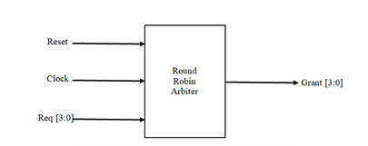

# Round Robin Arbiter (RRA)

Round Robin Arbiter (RRA) using Verilog HDL, aimed at achieving fair and efficient access to a shared resource among multiple devices. This project was developed using the Spartan-3E FPGA and simulated with Xilinx ISE and Cadence Virtuoso tools.
## Introduction
In digital systems, especially in multi-processor and embedded environments, resource contention is common. A Round Robin Arbiter resolves this by granting access to multiple requesters in a cyclic and fair manner, avoiding starvation and ensuring equitable resource distribution.

Key Concepts:
- Fairness: Every requester gets a turn in a fixed cyclic order.
- Efficiency: Quick decision-making logic.
- Prevention of starvation: No requester is indefinitely delayed.
The arbiter is implemented in Verilog and deployed on the Spartan XC3S50™ FPGA.

## Tools Used
To implement and validate the Round Robin Arbiter, the following tools and platforms were used:
### Software
- Xilinx ISE 9.2i (For simulation, synthesis, and verification of Verilog code.)
- Cadence Virtuoso Studio (For gate-level synthesis and power/timing/area analysis.)
### Hardware
- Spartan-3E FPGA (XC3S50) (Used for real-time deployment and LED output verification.)

## Setting Up the Project

Clone the repository:
```bash
git clone https://github.com/<your_username>/round-robin-arbiter.git
cd round-robin-arbiter
```
### Running the Simulation
1.	Open the project in Xilinx ISE 9.2i.
2.	Add round_robin.v and testbench.v files.
3.	Run simulation and view RTL schematic, waveform outputs, and timing analysis.
### FPGA Implementation
1.	Synthesize the design and generate the bitstream.
2.	Upload to Spartan XC3S50™.
3.	Use toggle switches to simulate requests and observe the grant outputs on LEDs.

## Functional Overview

The RRA takes in 4 request signals and outputs 4 grant signals using a cyclic priority mechanism. Each device is granted access in a round-robin fashion, ensuring fair scheduling.

### Block Diagram


#### Inputs
- req0 to req3: Request signals from processors
- clk: Clock input
- rst: Reset signal

#### Outputs
- gnt0 to gnt3: Grant signals corresponding to the processors

#### Internal Logic 
- The RRA uses masking, priority rotation, and grant logic to ensure fair allocation.
## Simulation Results and Output

The Verilog code for the round-robin arbiter successfully passed simulation, showing 
correct LED outputs on the Spartan XC3S50™ board, and was verified through synthesis 
with Cadence, which confirmed that it meets all timing, area, and power constraints, thus 
ensuring its suitability for practical hardware deployment.

### Simulation Results: 
The simulation results include a model view, RTL schematic, and gate-level block 
diagrams. 


model view of a Round-Robin Arbiter that takes requests, a clock 
signal, and a reset signal as inputs and provides a grant signal as the output. This model 
view represents the connections of various blocks. Double-clicking reveals the RTL 
schematic


Each block in this RTL schematic contains various gate connections. double-clicking the 
block reveals the gate connections.


### Synthesis Reports:
- Area: 412.474 µm²
- Gates Used: 19
- Power Consumption: 3.53e-05 W
- Timing Slack: 6950 ps

#### FPGA Output:
LEDs responded correctly to toggle switch inputs simulating processor requests.

#### Simulation waveform :


## Visualization
- RTL schematic
- Timing diagram
- Power and area reports
- Functional waveform showcasing grant signals on processor requests

## Conclusion 

The Round Robin Arbiter ensures fair, efficient, and systematic access to shared resources. It prevents starvation and maintains predictability, making it ideal for applications like:
- Shared bus arbitration
- Queue scheduling
- Resource allocation in NoC and multiprocessor systems
